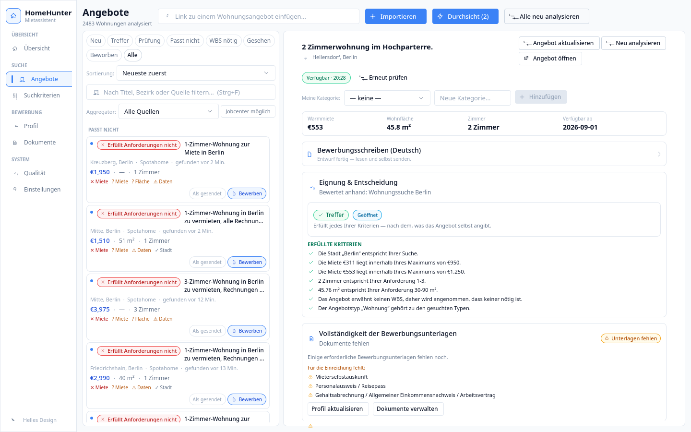

# HomeHunter — Produktseite

Statische Einzelseite für Daten- und Schnittstellenpartner. Ein HTML, ein CSS,
ein kurzes Skript für den Sprachumschalter. Kein Build, keine Abhängigkeiten,
keine externen Adressen.

    index.html    Seite, Deutsch und Englisch im selben Dokument
    style.css     Gesamtes Layout, einschließlich Druckfassung (A4)
    img/          Bildschirmfotos — noch zu ergänzen, siehe unten
    .nojekyll     GitHub Pages soll nichts verarbeiten

## Ansehen

    python3 -m http.server -d . 8000    # http://localhost:8000

Die Datei lässt sich auch direkt im Browser öffnen; ein Server wird nicht
gebraucht.

## Noch zu ergänzen

**1. Bildschirmfotos.** Vier Stück, PNG, jeweils 1600 px breit (also doppelte
Auflösung für scharfe Darstellung auf HiDPI-Bildschirmen). Die Seite zeigt
solange beschriftete Platzhalter.

| Datei | Inhalt | Empfohlene Größe |
|---|---|---|
| `img/01-liste.png` | Die Liste der gefundenen Wohnungen, neueste zuerst | 1600 × 1000 px |
| `img/02-gruende.png` | Eine Karte mit den Gründen des Urteils | 1600 × 1000 px |
| `img/03-sichtung.png` | Der Sichtungsmodus, eine Wohnung bildschirmfüllend | 1600 × 1000 px |
| `img/04-anschreiben.png` | Das fertige Anschreiben auf Deutsch | 1600 × 1000 px |

Danach in `index.html` jedes

    
img/01-liste.png

ersetzen durch

    

Beide Sprachfassungen enthalten dieselben vier Stellen.

**2. Anschrift für das Impressum.** In `index.html` steht zweimal der
Platzhalter `[STRASSE, PLZ BERLIN]` — je einmal in der deutschen und in der
englischen Fußzeile. § 5 TMG verlangt eine ladungsfähige Anschrift; ohne sie
sollte die Seite nicht öffentlich gehen.

## Veröffentlichen

GitHub Pages, Zweig `master`, Wurzelverzeichnis. Eine eigene Domäne ist
vorzuziehen: eine Adresse auf `github.io` liest sich in einem Geschäftsbrief
schwach. Sobald es eine Domäne gibt, dort auch eine Postadresse einrichten und
diese statt der Gmail-Adresse auf der Seite eintragen (drei Stellen je
Sprachfassung: Kopf, Abschnitt „Status und Kontakt“, Impressum).
